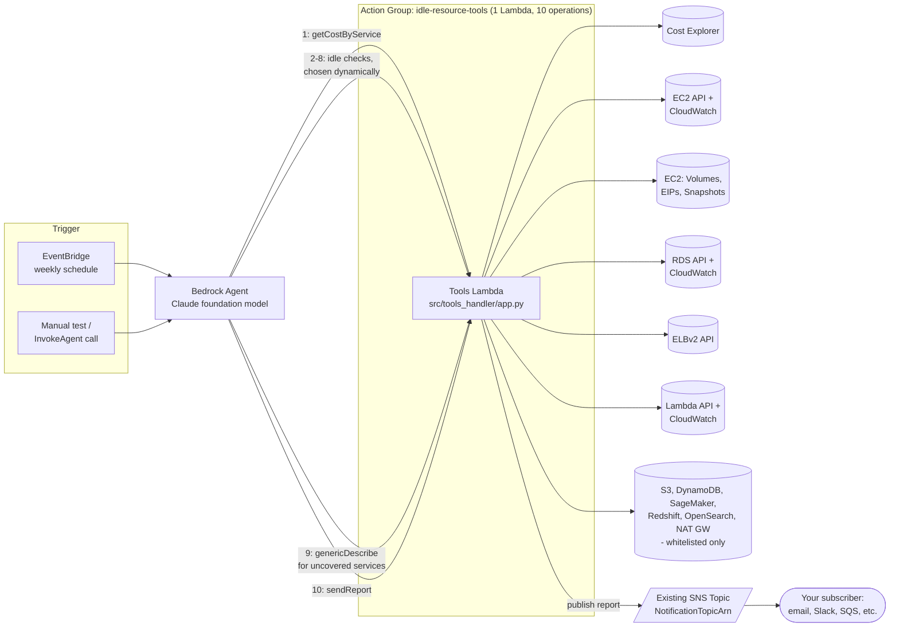
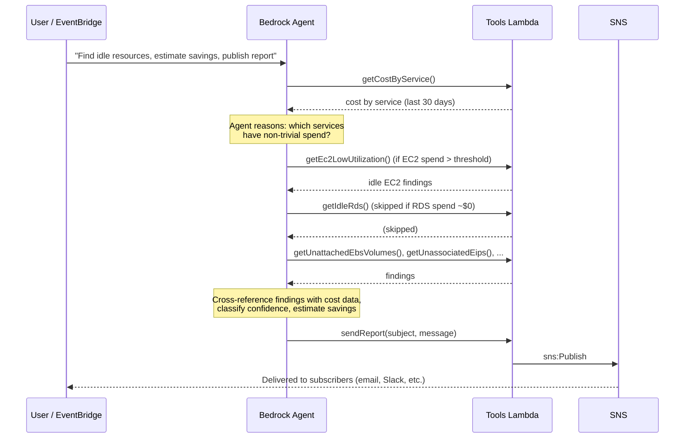

# AWS Idle Resource Agent

A small **agentic GenAI** project: an **Amazon Bedrock Agent** that inspects
your AWS account, figures out where money is actually being spent (via **Cost
Explorer**), and then decides for itself which idle-resource checks are worth
running — instead of blindly checking everything. It's **read-only**: it only
reports and recommends, never deletes or stops anything. The final report is
published to an **SNS topic** you provide (subscribe your email, Slack, or
anything else to that topic to receive it).

## Why this is "agentic" (not just a script)

A traditional script would run all checks every time. This project gives the
Bedrock Agent (Claude) a single Python Lambda exposing 10 read-only "tools"
(via a Bedrock Agent Action Group) and lets the model reason about which
tools to call and in what order:

1. Always calls `getCostByService` first (Cost Explorer, last 30 days).
2. Based on which services show real spend, it **chooses** which of the
   remaining 8 checks are worth running (e.g. skips RDS checks entirely if
   RDS costs are ~$0).
3. For high-cost services with no dedicated check (S3, DynamoDB, SageMaker,
   Redshift, OpenSearch, NAT Gateways), it can call `genericDescribe` - a
   whitelisted, read-only "escape hatch" tool (see below) - instead of
   silently ignoring that spend.
4. Cross-references findings against the cost data to estimate savings.
5. Classifies each finding's confidence.
6. Calls `sendReport` with a written summary, which publishes to SNS (email).

## Handling costly services with no dedicated tool

Bedrock Agents can only invoke tools you've explicitly defined - they can't
invent a new AWS API call on the fly. To avoid silently missing high-cost
services outside the 8 hardcoded checks (EC2, EBS, EIP, RDS, ELB, Lambda,
snapshots), there's a 9th check-style tool: **`genericDescribe`**.

- The agent passes a `service`, `operation`, and optional JSON-encoded
  `params` (e.g. `service: dynamodb, operation: describe_table`).
- The Lambda only executes the call if `(service, operation)` is in a
  hardcoded whitelist (`GENERIC_ALLOWED_OPERATIONS` in `app.py`) covering
  read-only `Describe*/List*/Get*` operations for S3, DynamoDB, SageMaker,
  Redshift, OpenSearch, NAT Gateways, and CloudWatch metrics. Anything not
  whitelisted is rejected before any AWS API call is made - the model
  cannot use this to call arbitrary or destructive APIs.
- The agent's instruction tells it to try `genericDescribe` for costly,
  uncovered services, and to explicitly list any still-uncovered service
  under an "Uncovered services - recommend manual review" section rather
  than omitting it from the report.

## Architecture



**Agent decision flow** (why this is "agentic" and not a fixed pipeline):



All 10 "tools" are operations on **one** Lambda function
(`src/tools_handler/app.py`), routed by `apiPath`. This keeps the project
simple to deploy while still exposing a rich toolset to the agent.

## Repo layout

```
template.json                Plain CloudFormation (JSON): Lambda, IAM, Bedrock Agent + Action Group
src/tools_handler/app.py    All read-only checks + SNS report publisher
src/tools_handler/requirements.txt
scripts/deploy.ps1          Zip, upload to S3, and deploy (PowerShell)
scripts/deploy.sh           Zip, upload to S3, and deploy (bash)
```

## Prerequisites

- AWS account with **Bedrock model access enabled** for
  `anthropic.claude-3-5-sonnet-20240620-v1:0` (or change `BedrockModelId`)
  in the Bedrock console → Model access.
- AWS CLI configured with credentials that can deploy CloudFormation.
- An **existing SNS topic** to receive the report (this stack does not
  create one). Create it yourself and subscribe whatever endpoint you want
  (email, Slack via Lambda/chatbot, another Lambda, SQS, etc.):
  ```bash
  aws sns create-topic --name idle-resource-agent-reports
  aws sns subscribe --topic-arn <topic-arn> --protocol email --notification-endpoint you@example.com
  ```
  (Confirm the subscription email AWS sends you before reports will arrive.)
- An S3 bucket you can upload the Lambda deployment package to (any bucket
  in the same region works).
- Python 3.12.

This project uses **plain CloudFormation** (`template.json`, no
`Transform: AWS::Serverless-2016-10-31`, no SAM CLI required). Because
there's no SAM packaging step, the Lambda code must be zipped and uploaded
to S3 before `aws cloudformation deploy` runs — the provided scripts do
both steps for you.

## Deploy

**PowerShell:**
```powershell
.\scripts\deploy.ps1 -Bucket my-deploy-bucket -NotificationTopicArn arn:aws:sns:ap-southeast-1:123456789012:idle-resource-agent-reports
```

**bash:**
```bash
./scripts/deploy.sh my-deploy-bucket arn:aws:sns:ap-southeast-1:123456789012:idle-resource-agent-reports
```

Both scripts: zip `src/tools_handler/`, upload it to
`s3://<bucket>/idle-resource-agent/tools_handler.zip`, then run
`aws cloudformation deploy` with `NotificationTopicArn`, `CodeS3Bucket`,
`CodeS3Key`, and `BedrockModelId` as parameters.

The SNS topic must already exist and already have your desired
subscription(s) confirmed — see Prerequisites above. After deploy, note the
`AgentId` stack output.

To redeploy after changing `src/tools_handler/app.py`, just re-run the
same script — it re-zips, re-uploads, and updates the stack (Lambda code
changes are picked up automatically by CloudFormation on redeploy).

## Try it

In the Bedrock console → Agents → your agent → **Test**, or via CLI:

```bash
aws bedrock-agent-runtime invoke-agent \
  --agent-id <AgentId> \
  --agent-alias-id TSTALIASID \
  --session-id demo-session-1 \
  --input-text "Find unused AWS resources from the last 30 days, estimate wasted spend, and publish the report." \
  output.json
```

## Local smoke test (no agent needed)

Run individual checks directly against your AWS account/credentials:

```bash
cd src/tools_handler
pip install -r requirements.txt
python app.py cost        # cost by service
python app.py ec2         # idle EC2 instances
python app.py ebs         # unattached volumes
python app.py eip         # unassociated Elastic IPs
python app.py rds         # idle RDS instances
python app.py elb         # idle load balancers
python app.py lambda      # stale Lambda functions
python app.py snapshots   # old orphaned snapshots
```

## Safety

Every IAM permission granted to the Lambda is `Describe*` / `List*` / `Get*`
plus `sns:Publish` to the report topic only. There is no `Stop*`,
`Terminate*`, or `Delete*` permission anywhere in `template.json` — the
agent's instructions also explicitly forbid recommending automated remediation.

The `genericDescribe` tool adds a second layer of defense-in-depth: even
though its IAM permissions are also read-only, the Lambda additionally
enforces a hardcoded `(service, operation)` whitelist in code
(`GENERIC_ALLOWED_OPERATIONS`) before making any AWS API call, so the model
can't call an unexpected boto3 method even if the IAM policy happened to
allow it.

## Possible extensions

- Schedule via EventBridge for a weekly automated report.
- Store historical reports in S3 and build a small trend dashboard.
- Add a "dry-run remediation" action group gated behind human approval.
